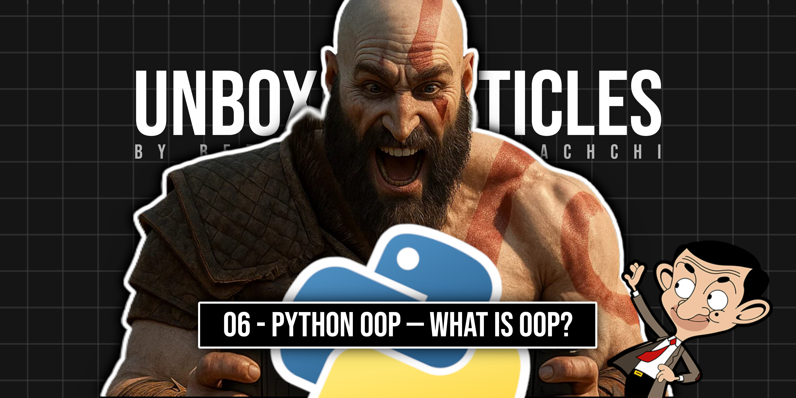
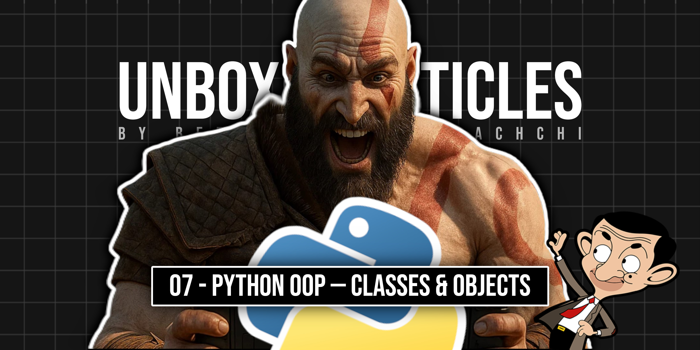

# Hi, I'm Beenuka Hettiarachchi 

I'm a self-taught Python developer who loves solving problems that actually matter. I build things to make life easier — for myself and for others. I'm always experimenting, learning, and trying to turn simple, clean code into useful tools people can rely on.

Lately, I’ve also fallen in love with writing. I write articles mostly about programming, but I sometimes dive into topics that spark my curiosity — like aviation, biology, neuroscience, productivity, engineering and more.

### 🛠 Tech Stack
- **Languages:** Python
- **Tools:** 
- **Interests:** Automations, AI/ML (learning), Aerospace Engineering

### 📌 Projects  
- [📊 Coming Soon] – 🤫🤐

### ✍️ Recent Articles
<!--
- [Build Your First Telegram Bot with Python — For Absolute Beginners](https://beenuka.hashnode.dev/build-telegram-bot-python)
- [Give a Warm Welcome — Create Your First Telegram Welcome Bot](https://beenuka.hashnode.dev/python-telegram-welcome-bot)-->

<table>
  <tr>
    <td>
      
    </td>
    <td>
      <a href='https://beenuka.hashnode.dev/build-telegram-bot-python'>
      Build Your First Telegram Bot with Python — For Absolute Beginners
      </a>
    </td>
  </tr>
    <tr>
    <td>
      
    </td>
    <td>
      <a href='https://beenuka.hashnode.dev/python-telegram-welcome-bot'>
      Give a Warm Welcome — Create Your First Telegram Welcome Bot
      </a>
    </td>
  </tr>
  </tr>
    <tr>
    <td>
      
    </td>
    <td>
      <a href='https://beenuka.hashnode.dev/inline-keyboard-telegram-bot-pyrogram'>
      Even Your Bot Deserves Love — Build One That Asks for It
      </a>
    </td>
  </tr>
    </tr>
    <tr>
    <td>
      
    </td>
    <td>
      <a href='https://beenuka.hashnode.dev/10-python-tricks-for-beginners'>
      10 Python Tricks That Make You Look Like a Pro — For Absolute Beginners
      </a>
    </td>
  </tr>
      <tr>
    <td>
      
    </td>
    <td>
      <a href='https://beenuka.hashnode.dev/python-builtins-for-beginners'>
      Stop Writing Loops — 4 Python Built-ins Every Beginner Should Know
      </a>
    </td>
  </tr>
        <tr>
    <td>
      
    </td>
    <td>
      <a href='https://beenuka.hashnode.dev/what-is-python-oop'>
          Python OOP For Beginners - What Is OOP?
      </a>
    </td>
  </tr>
        <tr>
    <td>
      
    </td>
    <td>
      <a href='https://beenuka.hashnode.dev/python-oop-classes-and-objects'>
      Python OOP For Beginners - Classes & Objects
      </a>
    </td>
  </tr>
</table>

### 📫 Let's Connect
<!-- LinkedIn: [linkedin.com/in/beenuka-hettiarachchi](https://linkedin.com) *(optional)*
- Telegram: [@your_username](https://t.me/your_username)
- Dev Blog: [yourblog.dev](https://yourblog.dev) *(if available)*
-->
- [Instagram](https://instagram.com/beenuka.hettiarachchi)
- [Hashnode](https://beenuka.hashnode.dev)
- [Medium](https://medium.com/@beenuka.hettiarachchi.net)

<!--

-->

<table>
  <tr>
    <td>
      
    </td>
    <td>
      
    </td>
  </tr>
  <tr>
    <td colspan="2" align="center">
      
    </td>
  </tr>
</table>